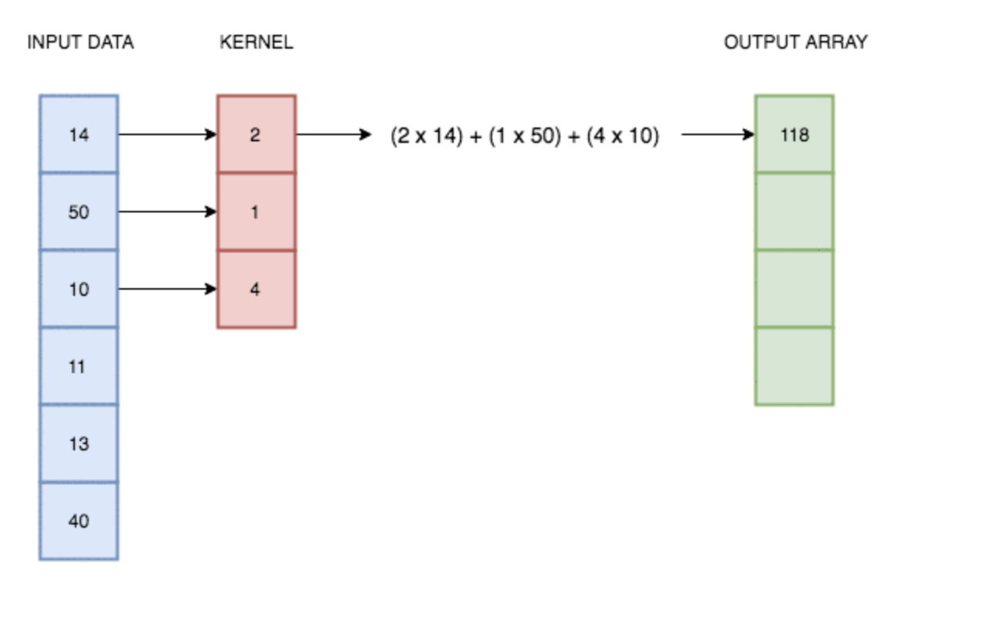
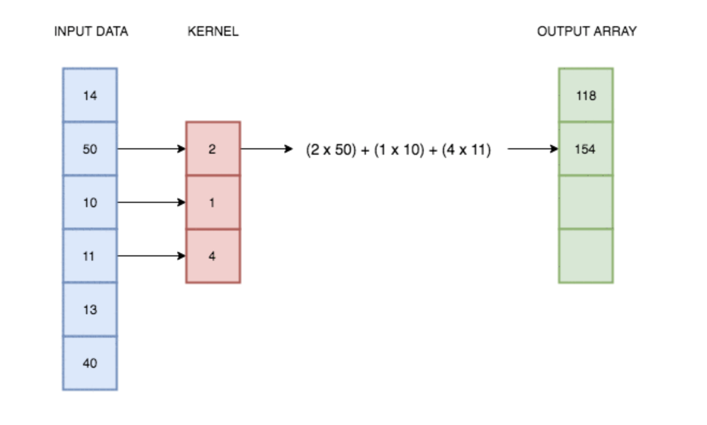
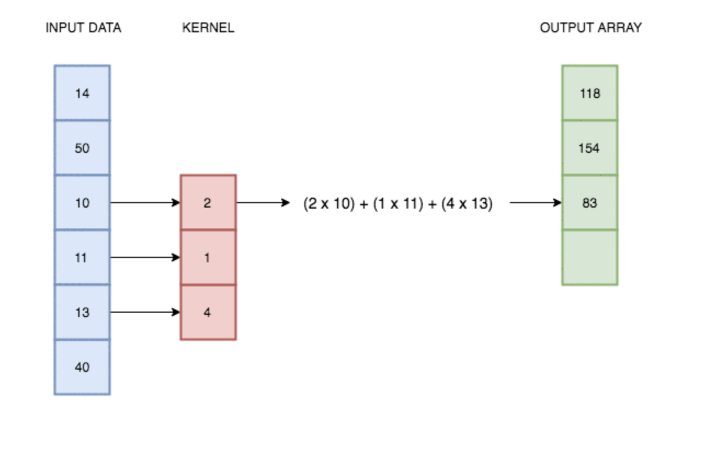
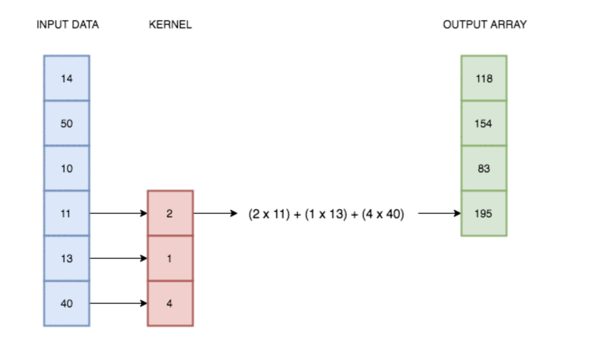

## TP3 : Convolution et mémoire partagée

Ce tp est à rendre sur ametice pour vendredi 17 mars 2022 24:00 date limite.

**Pour tout les TPs, vous pouvez vous mettre seul ou en groupe de 2.**

Une fois connecté à google colab, importez le fichier .ipnyb présent dans le code source. 

##### Simple convolution 1D

Dans la question 1.3. Il faut copier a et f dans d_a et d_filter et non pas b dans d_b.

La convolution est une opération permettant d'alterer une image en faisant glisser un filtre sur cette image. Cela peut permettre d'ajouter du flou sur l'image, de detecter le contours de certains objets d'un image et bien d'autres.

### Etape 1 de la convolution :


### Etape 2 de la convolution :


### Etape 3 de la convolution :


### Etape 4 de la convolution :


Fonction à rajouter dans utils.h pour le timer :

```
struct event_pair
{
  cudaEvent_t start;
  cudaEvent_t end;
};

inline void start_timer(event_pair * p)
{
  cudaEventCreate(&p->start);
  cudaEventCreate(&p->end);
  cudaEventRecord(p->start, 0);
}


inline void stop_timer(event_pair * p, char * kernel_name)
{
  cudaEventRecord(p->end, 0);
  cudaEventSynchronize(p->end);
  
  float elapsed_time;
  cudaEventElapsedTime(&elapsed_time, p->start, p->end);
  printf("%s took %.4f ms\n",kernel_name, elapsed_time);
  cudaEventDestroy(p->start);
  cudaEventDestroy(p->end);
}
```
